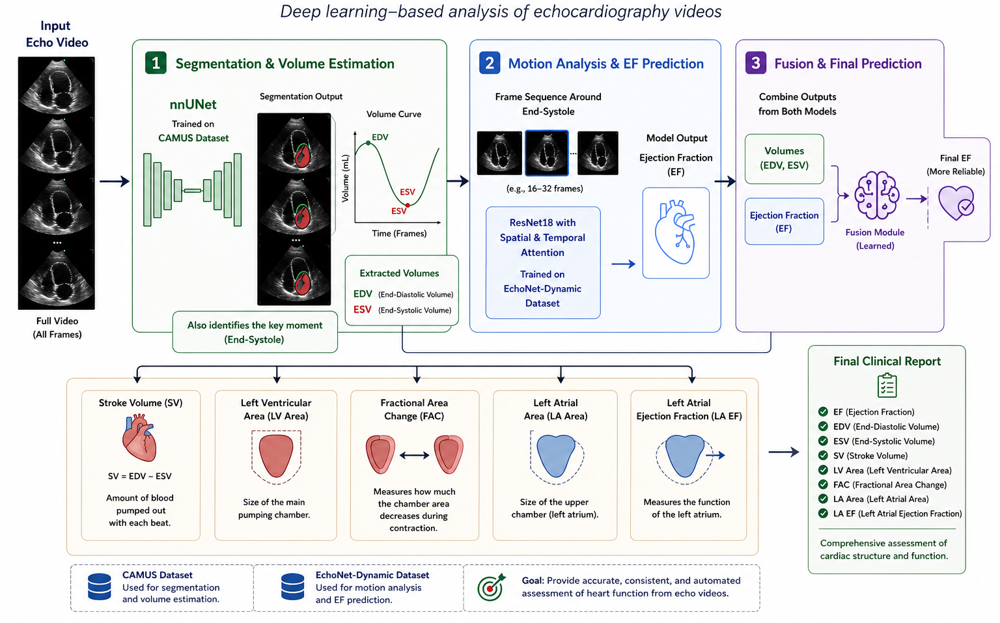

# CardioVision — AI Cardiac Function Analysis

Automated echocardiography analysis system.  
Upload two cardiac ultrasound sequences → get full clinical measurements, annotated frames, and a diagnostic report.

---

## Table of Contents

1. [What It Does](#what-it-does)
2. [System Architecture](#system-architecture)
3. [Project Structure](#project-structure)
4. [Prerequisites](#prerequisites)
5. [Installation](#installation)
6. [Running the Server](#running-the-server)
7. [Using the Demo UI](#using-the-demo-ui)
8. [API Reference](#api-reference)
9. [ML Pipeline](#ml-pipeline)
10. [Clinical Outputs](#clinical-outputs)
11. [For the Fullstack Team](#for-the-fullstack-team)
12. [Troubleshooting](#troubleshooting)

---

## What It Does

CardioVision takes two echocardiography video sequences of the heart and automatically:

1. **Segments** cardiac structures in every frame (Left Ventricle, Myocardium, Left Atrium)
2. **Detects** the two most important moments in the cardiac cycle — End-Diastole (ED) and End-Systole (ES)
3. **Computes** all standard clinical cardiac measurements using the Biplane Simpson method
4. **Predicts** Ejection Fraction independently using a 3D CNN video model
5. **Combines** both EF predictions into a final ensemble value
6. **Classifies** cardiac function (Normal / Mild / Moderate / Severe Dysfunction)
7. **Generates** annotated frame images and animated GIF overlays
8. **Returns** everything via a clean REST API

### What the Doctor Sees

```
Diagnosis:     Normal
Final EF:      61.42 %

EDV:           124.37 mL      (End-Diastolic Volume)
ESV:            48.12 mL      (End-Systolic Volume)
SV:             76.25 mL      (Stroke Volume)
LV Max Area:    21.42 cm²
LA Max Area:    18.37 cm²
FAC:            45.73 %       (Fractional Area Change)
LA EF:          52.18 %       (Left Atrial Ejection Fraction)
```

Plus four annotated images (ED and ES frames, raw and with segmentation overlay) and two animated GIFs of the full cardiac cycle.

---

## System Architecture

```
Browser / API Client
        │  HTTP
        ▼
  run.py  (uvicorn entry point)
        │
        ▼
  app/main.py  (FastAPI — CORS, static mounts, routers)
        │
        ├──► app/api/routes/studies.py   POST /upload  |  POST /analyze
        └──► app/api/routes/jobs.py      GET  /status  |  GET  /results
                    │
                    ├── app/schemas/          (Pydantic request/response contracts)
                    ├── app/storage/          (in-memory + JSON job store)
                    └── app/services/         (background thread execution)
                                │
                                ▼
                    app/ml_adapter/pipeline_wrapper.py
                    (sole boundary between product and ML code)
                                │
                                ▼
                    src/  (ML pipeline — never modified)
                    ├── predictors/       nnU-Net segmentation + ResNet3D EF
                    ├── postprocessing/   Biplane Simpson + metrics
                    └── visualization/    GIFs + annotated PNGs
```

**Key design rule:** The product layer (`app/`) and the ML pipeline (`src/`) are completely separate. `pipeline_wrapper.py` is the only file that crosses this boundary.

---

## Project Structure

```
CardioVision/
│
├── app/                            Product / API layer
│   ├── main.py                     FastAPI app — mounts, CORS, routers
│   ├── api/routes/
│   │   ├── studies.py              POST /upload, POST /analyze
│   │   └── jobs.py                 GET /status, /measurements, /visualizations, /report
│   ├── schemas/
│   │   ├── study.py                StudyUploadResponse
│   │   ├── job.py                  JobStatus, JobStage, JobStatusResponse
│   │   └── results.py              MeasurementsResult, VisualizationAssets, FullReport
│   ├── storage/
│   │   └── job_store.py            Thread-safe in-memory + JSON-file job store
│   ├── services/
│   │   └── job_service.py          Background thread manager
│   ├── ml_adapter/
│   │   └── pipeline_wrapper.py     ONLY file that imports from src/
│   └── static/
│       └── index.html              Demo UI (single HTML file)
│
├── src/                            ML pipeline — do not modify
│   ├── main_pipeline.py            Original standalone runner
│   ├── models/
│   │   ├── nnUnet_model.py         nnU-Net with Deep Supervision
│   │   └── resnet18_model.py       R(2+1)D-18 + Spatial/Temporal Attention
│   ├── predictors/
│   │   ├── segmentation_predictor.py
│   │   └── ef_video_predictor.py
│   ├── postprocessing/
│   │   └── cardiac_metrics.py
│   └── visualization/
│       └── visualization_utils.py
│
├── weights/
│   ├── best_unet_camus.pt          Segmentation model weights
│   └── best_resnet_model.pt        EF prediction model weights
│
├── test_cases/
│   └── patient0233/                Sample patient NIfTI files for testing
│       ├── patient0233_4CH_half_sequence.nii.gz
│       └── patient0233_2CH_half_sequence.nii.gz
│
├── outputs/                        Sample visualization outputs
├── jobs/                           Runtime — job state + results (git-ignored)
├── uploads/                        Runtime — uploaded files (git-ignored)
│
├── run.py                          Server entry point
├── requirements.txt
├── schema.drawio                   System architecture diagram
└── .gitignore
```

---

## Prerequisites

- Python 3.10+
- PyTorch + torchvision (install separately — see below)
- A GPU is optional but significantly speeds up inference

---

## Installation

### 1. Clone the repository

```bash
git clone <repo-url>
cd CardioVision
```

### 2. Create and activate a virtual environment

```bash
python -m venv ENV

# Windows
ENV\Scripts\activate

# macOS / Linux
source ENV/bin/activate
```

### 3. Install PyTorch

Go to [pytorch.org/get-started](https://pytorch.org/get-started/locally/) and pick the command for your system.

**CPU only (works everywhere):**
```bash
pip install torch torchvision
```

**GPU (CUDA 12.1 example):**
```bash
pip install torch torchvision --index-url https://download.pytorch.org/whl/cu121
```

### 4. Install project dependencies

```bash
pip install -r requirements.txt
```

This installs: `nibabel`, `opencv-python`, `imageio`, `fastapi`, `uvicorn[standard]`, `python-multipart`.

### 5. Verify model weights exist

```
weights/
  best_unet_camus.pt        ← segmentation model
  best_resnet_model.pt      ← EF video model
```

Both files must be present. If missing, contact the project owner for the download link.

---

## Running the Server

```bash
python run.py
```

**Default output:**
```
  CardioVision API  →  http://localhost:8000
  API Docs (Swagger) →  http://localhost:8000/docs
```

**Use a different port:**
```bash
python run.py --port 8080
```

> **Note:** First startup is slow (15–30 seconds) because both ML models are loaded into RAM. After that, each analysis runs without reloading them.

> **Do not use `--reload`** (uvicorn hot-reload). It kills background inference threads mid-run.

---

## Using the Demo UI

Open **http://localhost:8000** in your browser.

### Step 1 — Upload

Select the two NIfTI files for a patient study:

| Field | File |
|---|---|
| 4-Chamber View | `patient0233_4CH_half_sequence.nii.gz` |
| 2-Chamber View | `patient0233_2CH_half_sequence.nii.gz` |

Test files are in `test_cases/patient0233/`.

Click **Run Analysis**.

### Step 2 — Wait

The UI polls the server every 3 seconds and shows real-time progress:

```
SEGMENTATION  ████████░░░░  45%
Segmenting cardiac structures (LV, myocardium, LA)…
```

Pipeline stages in order:
1. `segmentation` — nnU-Net runs on every frame of both sequences
2. `measurement` — Biplane Simpson computes volumes, ED/ES detected, metrics calculated
3. `cnn_inference` — ResNet3D predicts EF from the raw video
4. `visualization` — GIFs and annotated PNGs generated

### Step 3 — Results

Once complete, the UI displays:

- **Diagnosis banner** — color-coded (green = Normal, yellow = Mild, orange = Moderate, red = Severe)
- **Key stats** — Final EF, EDV, ESV
- **Full measurements table** — all 10 clinical values with method labels
- **ED / ES frame viewer** — original + segmentation overlay, side by side
- **Cardiac cycle GIFs** — raw sequence and segmentation overlay animated
- **Raw JSON** — collapsible section showing the full API response (useful for developers)

---

## API Reference

**Base URL:** `http://localhost:8000`  
**Interactive docs:** `http://localhost:8000/docs`  
**Processing is asynchronous** — upload → trigger → poll → fetch results.

---

### POST `/api/studies/upload`

Upload a new echocardiography study (two NIfTI files).

**Request** — `multipart/form-data`

| Field | Type | Required | Description |
|---|---|---|---|
| `file_4ch` | file | Yes | 4-Chamber view `.nii` or `.nii.gz` |
| `file_2ch` | file | Yes | 2-Chamber view `.nii` or `.nii.gz` |

**Response** — `201 Created`

```json
{
  "study_id": "d36618a7-6d2b-4d89-b083-6183eba200c0",
  "status": "uploaded",
  "created_at": "2026-05-12T10:00:00.000000",
  "message": "Files saved. POST /api/studies/{study_id}/analyze to start analysis."
}
```

---

### POST `/api/studies/{study_id}/analyze`

Create an analysis job and start the ML pipeline in the background.

**Response** — `202 Accepted`

```json
{
  "job_id": "74ce41f0-1a91-40fd-8bdc-05508ea96afc",
  "study_id": "d36618a7-6d2b-4d89-b083-6183eba200c0",
  "status": "queued",
  "created_at": "2026-05-12T10:00:05.000000"
}
```

---

### GET `/api/jobs/{job_id}`

Poll this endpoint to track pipeline progress. Call every 3–5 seconds.

**Response** — `200 OK`

```json
{
  "job_id": "74ce41f0-1a91-40fd-8bdc-05508ea96afc",
  "study_id": "d36618a7-6d2b-4d89-b083-6183eba200c0",
  "status": "running",
  "stage": "segmentation",
  "progress_pct": 45,
  "error_message": null,
  "started_at": "2026-05-12T10:00:06.000000",
  "completed_at": null,
  "created_at": "2026-05-12T10:00:05.000000"
}
```

**Status values:**

| Status | Meaning |
|---|---|
| `queued` | Job created, waiting for a thread to pick it up |
| `running` | Pipeline is actively executing |
| `completed` | All stages done, results are ready |
| `failed` | An error occurred — see `error_message` |

**Stage values (while running):**

| Stage | Progress | What is happening |
|---|---|---|
| `segmentation` | 5 → 60% | nnU-Net segments every frame in both views |
| `measurement` | 65% | ED/ES detection + Biplane Simpson + all metrics |
| `cnn_inference` | 70% | ResNet3D predicts EF from 48-frame clip |
| `visualization` | 80% | GIFs and PNGs generated and saved |
| `done` | 100% | All outputs written to disk |

---

### GET `/api/jobs/{job_id}/measurements`

Returns all clinical measurements. Only available when `status == "completed"`.

**Response** — `200 OK`

```json
{
  "ef_biplane": 60.10,
  "ef_cnn": 62.80,
  "ef_final": 61.45,
  "edv_ml": 124.37,
  "esv_ml": 48.12,
  "sv_ml": 76.25,
  "lv_area_max_cm2": 21.42,
  "fac_pct": 45.73,
  "la_area_max_cm2": 18.37,
  "la_ef_pct": 52.18,
  "ed_frame_index": 14,
  "es_frame_index": 6,
  "diagnosis": "Normal"
}
```

> `ef_cnn` is `null` when the video sequence has fewer than 48 frames. `ef_final` falls back to `ef_biplane` in that case.

---

### GET `/api/jobs/{job_id}/visualizations`

Returns URL paths for all generated images and GIFs.

**Response** — `200 OK`

```json
{
  "original_gif":  "/media/74ce41f0.../outputs/original.gif",
  "overlay_gif":   "/media/74ce41f0.../outputs/overlay.gif",
  "ed_original":   "/media/74ce41f0.../outputs/ED_original.png",
  "ed_overlay":    "/media/74ce41f0.../outputs/ED_overlay.png",
  "es_original":   "/media/74ce41f0.../outputs/ES_original.png",
  "es_overlay":    "/media/74ce41f0.../outputs/ES_overlay.png"
}
```

Each URL is directly usable as an `` or `<video src>` value.

**Segmentation color code:**

| Color | Structure |
|---|---|
| Blue | Left Ventricle (LV) |
| Green | Myocardium |
| Red | Left Atrium (LA) |

---

### GET `/api/jobs/{job_id}/report`

Returns the complete structured report in a single call. Use this after polling confirms `status == "completed"`.

**Response** — `200 OK`

```json
{
  "job_id": "74ce41f0-1a91-40fd-8bdc-05508ea96afc",
  "study_id": "d36618a7-6d2b-4d89-b083-6183eba200c0",
  "generated_at": "2026-05-12T10:01:12.000000",
  "diagnosis": "Normal",
  "ef_final": 61.45,
  "measurements": { ... },
  "visualizations": { ... }
}
```

---

### GET `/health`

Simple liveness check.

```json
{ "status": "ok", "service": "CardioVision API" }
```

---

## ML Pipeline

### Input Format

The system requires two echocardiography sequences in NIfTI format:

| View | Description |
|---|---|
| `4CH` | Four-Chamber view — primary view, used for all measurements |
| `2CH` | Two-Chamber view — used jointly for biplane volume calculation |

Files must be `.nii` or `.nii.gz`. The pixel spacing (mm/pixel) is read from the NIfTI header and used to convert pixel areas into physical units (cm², mL).

### Pipeline Stages

```
NIfTI Load
    │  nibabel reads (W,H,T) → transposed to (T,H,W)
    ▼
Frame-wise Segmentation  [nnU-Net with Deep Supervision]
    │  Each frame: normalize → resize to 384×384 → argmax of 4-class output
    │  → mask: 0=BG, 1=LV, 2=Myocardium, 3=LA
    ▼
Volume Curve + ED/ES Detection
    │  Biplane Simpson per frame → volume curve
    │  ED = argmax(volumes)   ES = argmin(volumes)
    ▼
Clinical Measurements
    │  EDV, ESV, EF, SV from biplane volumes
    │  LV area, FAC from 4CH mask areas
    │  LA area, LA EF from 4CH mask areas
    ▼
3D CNN EF Prediction  [R(2+1)D-18 + Attention]
    │  48-frame clip centered on ES frame
    │  Input shape: (1, 3, 48, 112, 112)
    │  Outputs: EF% as a single float
    ▼
Ensemble
    │  Final EF = (biplane EF + CNN EF) / 2
    │  If video < 48 frames: Final EF = biplane EF only
    ▼
Diagnosis Classification
    │  ≥ 55% → Normal
    │  40–54% → Mild Dysfunction
    │  30–39% → Moderate Dysfunction
    │  < 30%  → Severe Dysfunction
    ▼
Visualization
       original.gif + overlay.gif
       ED_original.png + ED_overlay.png
       ES_original.png + ES_overlay.png
```

### Models

| Model | File | Task | Architecture |
|---|---|---|---|
| Segmentation | `weights/best_unet_camus.pt` | 4-class per-frame segmentation | nnU-Net with Deep Supervision |
| EF Regression | `weights/best_resnet_model.pt` | EF% from raw video | R(2+1)D-18 + Spatial & Temporal Attention |

Both models are loaded once at server startup and stay in memory for the lifetime of the process.

---

## Clinical Outputs

| Field | Unit | Method | Description |
|---|---|---|---|
| `ef_biplane` | % | Biplane Simpson | Ejection Fraction from segmentation |
| `ef_cnn` | % | 3D CNN | Ejection Fraction from raw video |
| `ef_final` | % | Ensemble avg | Final clinical EF value |
| `edv_ml` | mL | Biplane Simpson | End-Diastolic Volume |
| `esv_ml` | mL | Biplane Simpson | End-Systolic Volume |
| `sv_ml` | mL | EDV − ESV | Stroke Volume per beat |
| `lv_area_max_cm2` | cm² | Pixel sum × spacing | Max LV cross-sectional area |
| `fac_pct` | % | (Amax−Amin)/Amax | Fractional Area Change |
| `la_area_max_cm2` | cm² | Pixel sum × spacing | Max Left Atrial area |
| `la_ef_pct` | % | Area-based | Left Atrial Ejection Fraction |
| `ed_frame_index` | — | argmax(volumes) | Frame index of End-Diastole |
| `es_frame_index` | — | argmin(volumes) | Frame index of End-Systole |
| `diagnosis` | — | EF threshold | Normal / Mild / Moderate / Severe |

---

## For the Fullstack Team

### Integration Pattern

```
1. POST /api/studies/upload       → save file_4ch + file_2ch, get study_id
2. POST /api/studies/{id}/analyze → get job_id
3. GET  /api/jobs/{id}            → poll every 3s until status == "completed"
4. GET  /api/jobs/{id}/report     → fetch full results in one call
```

### Important Rules

- Upload must use `multipart/form-data` — not JSON base64. NIfTI files are binary.
- Processing is always async — never expect instant results from the analyze endpoint.
- `ef_cnn` can be `null` — always use `ef_final` as the display value.
- Image URLs (`/media/...`) are served by the same server — use them directly as ``.
- The API contract is defined in `app/schemas/` — Pydantic models are the source of truth.
- Full interactive API docs at `/docs` — importable as Postman collection.

### File Storage Layout

```
uploads/{study_id}/4ch.nii.gz         ← written by POST /upload
uploads/{study_id}/2ch.nii.gz

jobs/{job_id}/state.json              ← job status, updated as pipeline runs
jobs/{job_id}/outputs/original.gif    ← available after status == "completed"
jobs/{job_id}/outputs/overlay.gif
jobs/{job_id}/outputs/ED_original.png
jobs/{job_id}/outputs/ED_overlay.png
jobs/{job_id}/outputs/ES_original.png
jobs/{job_id}/outputs/ES_overlay.png
```

---

## Troubleshooting

### Port already in use

```
ERROR: [Errno 10048] error while attempting to bind on address ('0.0.0.0', 8000)
```

Another server process is still running. Kill it and restart:

```powershell
# Windows — kill whatever holds port 8000
Get-NetTCPConnection -LocalPort 8000 | Select -ExpandProperty OwningProcess | ForEach-Object { Stop-Process -Id $_ -Force }

# Then restart
python run.py
```

Or use a different port: `python run.py --port 8080`

---

### ef_cnn is null

Expected when the uploaded sequence has fewer than 48 frames (common with `half_sequence` test files). The system falls back to biplane EF only. `ef_final` is still valid.

---

### Slow startup

Both ML models load into RAM at startup. On CPU this takes 15–30 seconds. This is normal. Inference runs fast after that.

---

### Model weights not found

```
FileNotFoundError: weights/best_unet_camus.pt
```

The weights are not included in the repository. Place them in the `weights/` folder:

```
weights/
  best_unet_camus.pt
  best_resnet_model.pt
```

---

### Wrong file format

```
400: 'myfile.mp4' is not a valid NIfTI file. Expected .nii or .nii.gz
```

The system only accepts NIfTI format. Convert from DICOM using `dcm2niix` if needed.

---

## System Pipeline Diagram



See `schema.drawio` for the full software architecture diagram (open with [diagrams.net](https://app.diagrams.net)).
